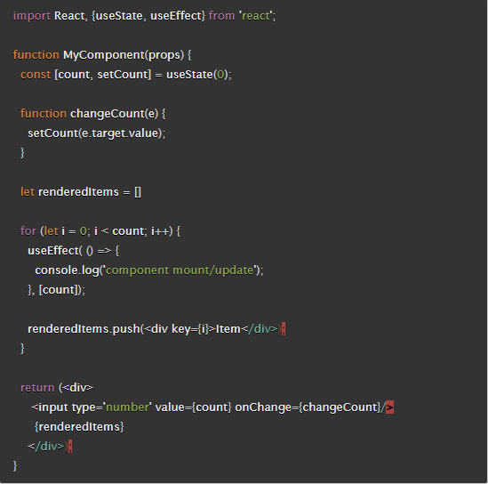

# Custom Hooks

## What does a component's lifecycle refer to?

A component's lifecycle refers to different stages of existence in the DOM. In addition to others, this includes:
- `componentDidMount()`
- `render()`
- `componentDidUpdate()`
- `componentWillUnmount()`

These give developers ways to interact with a component's before, after and during it's use in the DOM.

## Why do you sometimes need to "wrap" functions in `useCallback` when called from within `useEffect`?

Wrapping `useCallback()` around a function declaration and defining the dependencies of the function ensures that the function is only re-created if its dependencies changed. It can prevent infinite loops by preventing the function from being re-built on every render cycle.

- [medium](https://medium.com/@infinitypaul/reactjs-useeffect-usecallback-simplified-91e69fb0e7a3)

## Why are functional components preferred over class components?

Functional components do not use contextual `this`. There is no need to keep track of `this` any longer. Implicit binding is no longer necessary.

They also give developers more control of function logic.

## What is wrong with the following code?

I think the way the `useEffect()` is utilized in the for loop may result in an infinite loop. However, I would have to type in and test the code to be sure.

## Vocabulary Terms

| **Vocabulary Term** | **Definition** |
| --- | --- |
| **State Hook** | *`useState()` declares a "state variable" to preserve its value between function calls. It takes the place of `this.state` used in classes. it returns two values: the current state and a function that will update that state* [React Docs](https://reactjs.org/docs/hooks-state.html#:~:text=A%20Hook%20is%20a%20special,ll%20learn%20other%20Hooks%20later.) |
| **Effect Hook** | *`useEffect()` can be used to provide functional components the equivalent of the class component lifecycle methods such as `componentDidMount()`, `componentDidUpdate()` and `componentWillUnmount()`.* |
| **Reducer Hook** | *a reducer is a function which takes two arguments -- the current state and an action -- and returns, based on both arguments, a new state.* [*"What is a Reducer in JavaScript/React/Redux?"*](https://www.robinwieruch.de/javascript-reducer) |

[Back to Main](../README.md)